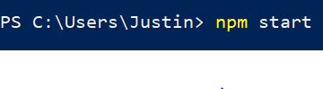

# Introduction to React Workshop
This is the starter code for the Introduction to React workshop taught by Justin Estaris

# Learning Goals
The goal of the workshop is to teach the member the following concepts:
- Single Page Applications vs Multi Page Applications

- Arrow Functions

- Building Components

- What and Why use React

# How to use this the downloaded files
0. Download node.js from https://nodejs.org/en/
1. Run **npm install** in the command terminal in the extracted folder

2. Run **npm start** in the command terminal to run the project

3. Look at wiki for the challenges and solution